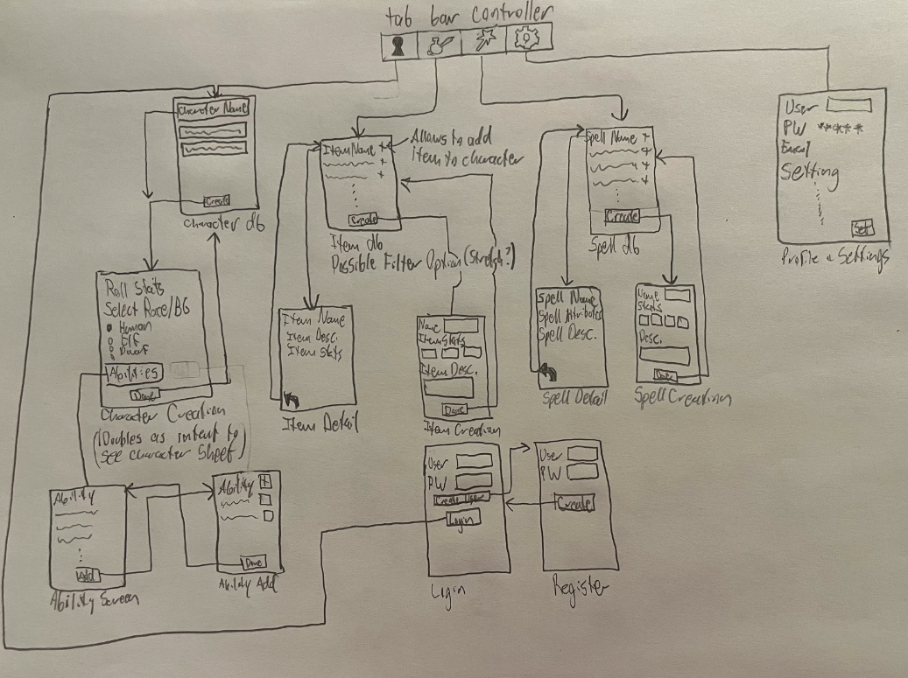

# Milestone 1 - App of Many Things

## Table of Contents

1. [Overview](#Overview)
1. [Product Spec](#Product-Spec)
1. [Wireframes](#Wireframes)

## Overview

### Description
We are going to have the players input their own items and spells that can be referred to and inputted in that can be accessed by them later. They can also put a picture from their camera roll, or take one to show at the top of the screen. Have the app have a set of modes to roll base stats from (could do the roll 4 remove lowest one or the point buy system) Gmail based login.

### App Evaluation

- **Category:** Entertainment/Social
- **Mobile:** 
       Our App is uniquely mobile because of the fact that it is easy to open and with their mobile device, they can stay on the app and keep playing instead of having to tab into their character sheet. More will be added later, but for now, we are planning this app to have camera support to set the picture of the character that you are going to use, and we are going to have people be able to log in and see what characters they have created. There is also a dice roller that users will be able to use and put modifiers on.
- **Story:** 
       Allows more fluid roleplay in dnd, by letting players conveniently access their character sheets. It will also let players learn more about what spells to use and how to level up properly. 
- **Market:** 
       This can be used by all people who want to learn how to play dnd, as this market is on the rise with DND gaining interest through a movie, as well as many podcasts, this app can help let the newer player base keep track of their characters easier, as well as learn how to play.
- **Habit:** 
       A user would most likely open this app about once a week, as dnd campaigns are usually held at a schedule of once a week. The app will be opened whenever the user wants to play dnd. Users will use our apps to create their characters and to actively change their stats, spells, items, etc.
- **Scope:** 
       Some of the most important parts of this program are going to be accessing the spell database and making a easy to use UI such that anyone can have the ability to create their character easily. A stripped down version of this project would still be interesting to build because it would just entail having the user input their own spells, items, etc. instead of guiding them through it as planned.

## Product Spec

### 1. User Features (Required and Optional)

**Required Features**

* Users can login
* Users can create new accounts
* Users will be able to create a full character for DnD 5e
* Users can assign stats, proficiencies, and other variables to a character
* Users can view a list of created characters on their account
* Users can create items, and store them in an account database
* Users can add items to a character, and have it stored on that character
* Users can create class abilities, and attatch them to the character
* Users can create spells, and store them in an account database
* Users can add spells to a character, and have it stored on that character

**Stretch Features**

* Users can export and import characters and items
* Toggle Starter/Expert Character Creation, auto-assign vs manual, homebrew options
* App can automatically give default equipment to characters

### 2. Screen Archetypes

- Login Screen **(Login)**
  - Input Username and Password
  - Check and determine is account exists in database
  - Shows if username & password is incorrect
- Register Screen **(Login)**
  - Allows user creation 
  - Inputs user profile into database
- Character Database Screen **(Detail)**
  - Lists all characters from the user's database
  - Select characters to see their stats, or edit them
- Character Creation Screen **(Creation)**
  - Ability to roll/buy and attribute stats
  - Select Race and Background
  - Select Class, Subsclass & Level
  - Selection of all Abilities, Proficiencies, Languages, Traits, etc
  - Set photo of character from Camera
- Item Database Screen **(Stream)**
  - Lists all items from the user's database
  - Select equipment, armor, and general items to add to a character
- Item Add Screen **(Creation)** (Stretch)
  - (Stretch) Allow for homebrew item creation and addition to database screen
- Item Detail Screen **(Detail)**
  - Shows the details of items
- Spells Database Screen **(Stream)**
  - Lists all spells from the user's database
  - Select spells to add to a character
- Spell Add Screen **(Creation)** (Stretch)
  - (Stretch) Allow for homebrew spell creation and addition to database screen
- Spell Detail Screen **(Detail)**
  - Shows the details of spells
- Ability Screen **(Stream)**
  - Allows the user to see the inherent abilities of a character
  - Can link to the ability creation screen
- Ability Add Screen **(Creation)**
   - Allow for the user to add abilities directly to a character
- Profile & Settings Screen **(Profile and Settings)**
  - Allows the user to change their preferences of the app

### 3. Navigation

**Tab Navigation** (Tab to Screen)

* Character Database Screen
* Item Database Screen
* Spell Database Screen
* Profile and Settings Screen

**Flow Navigation** (Screen to Screen)

- Login Screen **(Login)**
  - Character Database Screen
  - Register Screen
- Register Screen **(Login)**
  - Login Screen
- Character Database Screen **(Detail)**
  - Character Creation Screen
- Character Creation Screen **(Creation)**
  - Character Database Screen
  - Ability Screen
- Item Database Screen **(Stream)**
  - Item Detail Screen
  - Item Add Screen
- Item Add Screen **(Creation)** (Stretch)
  - Item Database Screen (After item is made)
- Item Detail Screen **(Detail)**
  - Item Database Screen (After detail screen closed)
- Spells Database Screen **(Stream)**
  - Spell Add Screen
  - Spell Detail Screen
- Spell Add Screen **(Creation)** (Stretch)
  - Spell Database Screen (After spell is made)
- Spell Detail Screen **(Detail)**
  - Spells Database Screen (After detail screen is closed)
- Ability Screen **(Stream)**
  - Ability Add Screen
- Ability Add Screen **(Creation)**
  - Ability Screen (After ability is made)
- Profile & Settings Screen **(Profile and Settings)**
  - None

## Wireframes

